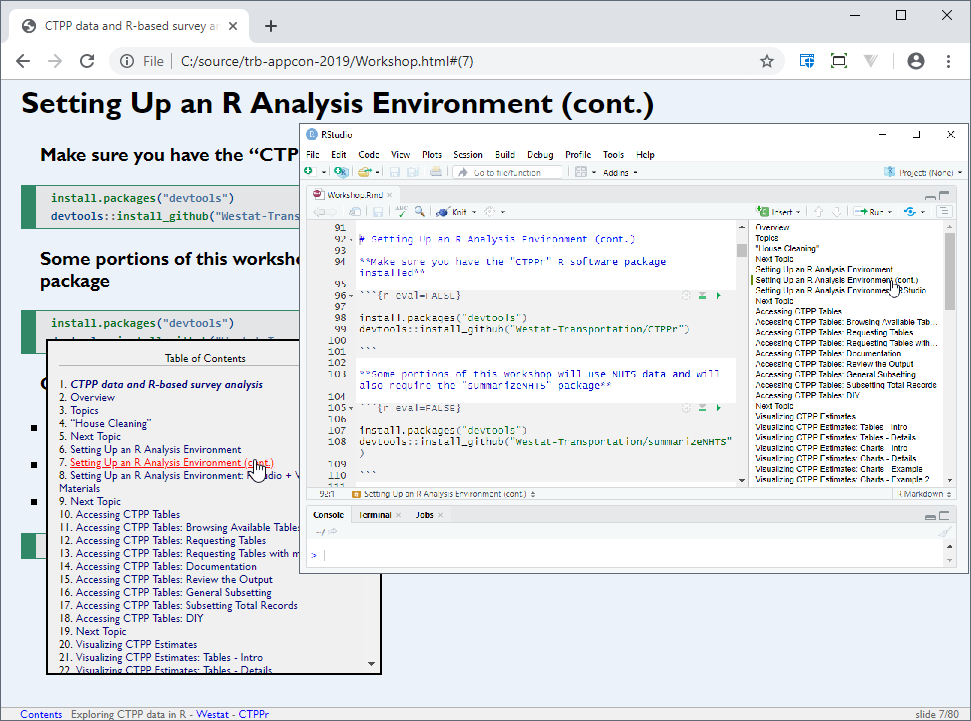

---------------------------------------------------------------------------

# Overview

**Workshop Goals**

- Demonstrate how to work with CTPP data in R
- Derive some comparable variables and estimates from the NHTS
- Visualize estimates from multiple sources
- Create reproduceable workshop materials to publish online
<!-- - **[Preview the report we are going to create](resources/report_example/report.html)** -->

---------------------------------------------------------------------------

# Topics

1. Setting Up an R Analysis Environment
2. Accessing CTPP Tables
3. Visualizing CTPP Estimates
4. Merging CTPP over Time
5. Merging Estimates with the NHTS
6. Extending CTPPr Visualizations
7. Producing a Travel Analysis Report

---------------------------------------------------------------------------

# "House Cleaning"

* 90 minutes!?
* Hold on to big questions
* This presentation is reproducible
* Take it with you, download it later, go at your own pace

**This presentation is intended for re-use**  

* Focus on the presentation itself today  
	↪ Later, follow along in RStudio at your own pace


**Presentation hotkeys**  

| Key | Action                                   |
|:----|:-----------------------------------------|
| C   | Show table of contents                   |
| F   | Toggles the display of the footer        |
| A   | Toggles display of current vs all slides |
| S   | Make fonts smaller                       |
| B   | Make fonts larger                        |

---------------------------------------------------------------------------

# Next Topic {.transition_slide}

1. **Setting Up an R Analysis Environment**
2. Accessing CTPP Tables
3. Visualizing CTPP Estimates
4. Merging CTPP Datasets
5. Merging Estimates with the NHTS
6. Extending CTTPr Visualizations
7. Producing a Travel Analysis Report

---------------------------------------------------------------------------

# Setting Up an R Analysis Environment

**[Click here for latest installation instructions](https://github.com/Westat-Transportation/CTPPr/tree/master/inst/install)**

**Instructions provide explicit download links for**

- R
- R Tools
- RStudio

**Once installed, open RStudio**

---------------------------------------------------------------------------

# Setting Up an R Analysis Environment (cont.)

**Make sure you have the "CTPPr" R software package installed**

```{r eval=FALSE}

install.packages("devtools")
devtools::install_github("Westat-Transportation/CTPPr")
  
```

**Some portions of this workshop will use NHTS data and will also require the "summarizeNHTS" package**

```{r eval=FALSE}

install.packages("devtools")
devtools::install_github("Westat-Transportation/summarizeNHTS")
  
```

**OK, we're ready!**

- Your R environment for CTPP analysis is set up
- You only need to set up an environment once
- From now on, just open RStudio and load CTPPr package

```{r, message=F, warning=F}

library(CTPPr)

```

```{r echo=F, message=F, warning=F}

# summarizeNHTS libary is required if you want to generate NHTS estimates to complete this Workshop
library(summarizeNHTS, exclude = c("make_table", "make_chart", "make_map", "format_values", "use_moe")) # don't load summarizeNHTS viz functions when loading both summarizeNHTS and CTPPr in the same environment

```

---------------------------------------------------------------------------

# Setting Up an R Analysis Environment: RStudio + Workshop Materials



---------------------------------------------------------------------------

# Next Topic {.transition_slide}

1. Setting Up an R Analysis Environment
2. **Accessing CTPP Tables**
3. Visualizing CTPP Estimates
4. Merging CTPP Datasets
5. Merging Estimates with the NHTS
6. Extending CTTPr Visualizations
7. Producing a Travel Analysis Report

--------------------------------------------------------------------------

# Accessing CTPP Tables

- Browse available tables
- Request tables
- Review additional options
- Summarize and subset the output of a request

**Just a reminder, let's make sure the `CTPPr` package is loaded in R.**

```{r, message=FALSE}

library(CTPPr)

```

--------------------------------------------------------------------------

# Accessing CTPP Tables: Browsing Available Tables

- `ctpp_tables` is a function that lists the CTPP tables available for request
    + The default output is an interactive HTML page
    + Optionally specify a traditional table output

```{r, message=FALSE}

ctpp_tables()

```

--------------------------------------------------------------------------

# Accessing CTPP Tables: Requesting Tables

```{r, cache=FALSE}

# TOTAL WORKERS (1) (WORKERS 16 YEARS AND OVER)
A102101 <- download_ctpp(A102101)
	
```

- You can download tables from the 2006-2010 or 2012-2016 dataset using the `download_ctpp` function.
    + Downloads directly from the [Beyond 20/20 sites](http://data5.ctpp.transportation.org/).
- This basic `download_ctpp` request is accepting default options
    + For example, `'2012-2016'` is the default dataset parameter
- `A102101` is the new object we created. 
    + Note: It can be named anything to include more detail, e.g. `A101100_2016_OREGON_COUNTY`
- The tables outputted by `download_ctpp` always return:
    + The Residence or Workplace geography
    + Any categorical variable group, labelled
    + The Estimate and its Standard Error
    
--------------------------------------------------------------------------

# Accessing CTPP Tables: Requesting Tables with more Detail

```{r, cache=FALSE}

# TRAVEL TIME TO WORK (12) (WORKERS 16 YEARS AND OVER)
A102110 <- download_ctpp(
	id = "A102110", 
	geography = "County", 
	state = "Oregon", 
	dataset = "2016", 
	output = "Name"
)

```

- `download_ctpp` parameters
    + Required:
        - `id` - Table ID
    + Important:
        - `geography` - Geography level of results
        - `state` - State(s) to limit results by
        - `dataset` - Dataset year
        - `output` - Naming output type
        
--------------------------------------------------------------------------

# Accessing CTPP Tables: Documentation
    
- Refer to documentation within R using

```{r, eval=FALSE}

?download_ctpp

```


--------------------------------------------------------------------------

# Accessing CTPP Tables: Review the Output

- View data directly in R console

```{r, eval=F}

A102110

```

- Use the `summary` or `str` function to get an overview of the data structure

```{r, eval=F}

summary(A102110)
str(A102110)

```

- View with interactivity

```{r, eval=F}

View(A102110)

```

- If you need to remember what was in your request, review the attributes:

```{r, eval=F}

attributes(A102110)[c("id","name","report_type","dataset","output","geography")]

```

--------------------------------------------------------------------------

# Accessing CTPP Tables: General Subsetting

- Select specific columns
```{r, eval=FALSE}

# By position
A102110[, c(1, 2, 3)]

# By name (single variable)
A102110$Estimate

# By name
A102110[, c("Travel Time 12", "Estimate")]

```

- Select specific rows
```{r, eval=FALSE}

# By row numbers (first 5 rows)
A102110[1:5, ]

# By condition
A102110[RESIDENCE == "Multnomah County, Oregon", ]

# By condition (multiple values)
A102110[`Travel Time 12` %in% c("Less than 5 minutes","90 minutes or more"), ]

```

--------------------------------------------------------------------------

# Accessing CTPP Tables: Subsetting Total Records

- Total number records in tables are convenient but require our attention before analysis

- For example, A102110 (Travel Time to Work), contains multiple total levels
    - All workers
    - All workers - Worked at home / Did not work at home

| Base records        | Subtotal records     | Total records  |
|:--------------------|:---------------------|:---------------|
| Less than 5 minutes | Worked at home       | Total workers  |
| 5 to 14 minutes     | Did not work at home |                |
| 15 to 19 minutes    |                      |                |
| 20 to 29 minutes    |                      |                |
| 30 to 44 minutes    |                      |                |
| 45 to 59 minutes    |                      |                |
| 60 to 74 minutes    |                      |                |
| 75 to 89 minutes    |                      |                |
| 90 minutes or more  |                      |                |
| Worked at home      |                      |                |

- By subsetting, we can separate this request into 3 tables for analysis

```{r}

A102110_total <- A102110[`Travel Time 12` %in% c("All workers")]
A102110_subtotal <- A102110[`Travel Time 12` %in% c("Worked at home", "Did not work at home:")]

```

- Now remove the appropriate total variables from our original request

```{r}

A102110 <- A102110[!`Travel Time 12` %in% c("All workers","Did not work at home:"), ]

```

--------------------------------------------------------------------------

# Accessing CTPP Tables: DIY

**Using the documentation for `download_ctpp`, request the following estimate from CTPP**

- Estimate: Means of transportation to work by age
- Dataset: Most recent
- Geography: State
- Labelled output: Names

```{r, echo=F}

ctpp_tables()

```

```{r, cache=FALSE}

B102203 <- download_ctpp(
	id = "B102203", 
	geography = "State",
	dataset = "2016",
	output = "Name"
)

```

---------------------------------------------------------------------------

# Next Topic {.transition_slide}

1. Setting Up an R Analysis Environment
2. Accessing CTPP Tables
3. **Visualizing CTPP Estimates**
4. Merging CTPP Datasets
5. Merging Estimates with the NHTS
6. Extending CTTPr Visualizations
7. Producing a Travel Analysis Report

---------------------------------------------------------------------------

# Visualizing CTPP Estimates

- Demonstrate 3 core visualization functions
    + `make_table` - Create report-ready, formatted tables.
    + `make_chart` - Create interactive bar charts.
    + `make_map` - Create interactive choropleth maps.
- Quick and easy steps for visuals:
    1. Assign the output of `download_ctpp` to a new object.
    2. Feed this new object to one of the visualization functions to review results.

--------------------------------------------------------------------------

# Visualizing CTPP Estimates: Tables - Intro

- Let's look at default table outputs for the two tables we just requested

<div style="float: left; width: 50%;">
```{r}

make_table(A102101)

```
</div>

<div style="float: right; width: 50%;">
```{r}

make_table(A102110)

```
</div>
</div>

--------------------------------------------------------------------------

# Visualizing CTPP Estimates: Tables - Details

- Default options make a best guess based on type and length of data

- Use different options to improve your desired output

- `make_table` parameters
    + Required:
        - `tbl` - Table object
    + Important:
        - `row_vars` - variable(s) to put at the row level
        - `col_vars` - variable(s) to put at the column level
        - `title` - output with a title
        - `confidence` - Confidence level for margin of error

- Using the A102110 table from the previous slide, we can provide a title, specify a confidence level, and flip default row/column output

```{r}

make_table(
	tbl = A102110,
	row_vars = "RESIDENCE",
	title = "Travel Time to Work for Counties in Oregon",
	confidence = 0.95
)

```

--------------------------------------------------------------------------

# Visualizing CTPP Estimates: Charts - Intro

```{r}

make_chart(A102101)

```

--------------------------------------------------------------------------

# Visualizing CTPP Estimates: Charts - Details

- `make_chart` parameters
    + Required:
        - `tbl` - Table object
    + Important:
        - `x` - variable for x-axis
        - `y` - variable for y-axis
        - `fill` - variable to categorize by color
        - `facet` - variable to categorize smaller multiple charts by
        - `flip` - rotate chart by axis
        - `order` - order values by frequency vs default
        - `pallette` - a color palette to use
        - ..and more

- Using the A102110 table from the previous slide, let's experiment with different outputs...

--------------------------------------------------------------------------

# Visualizing CTPP Estimates: Charts - Example

- Remove the legend

```{r}

make_chart(
	tbl = A102101,
	legend = FALSE
)

```

--------------------------------------------------------------------------

# Visualizing CTPP Estimates: Charts - Example 2

- Order the values

```{r}

make_chart(
	tbl = A102101,
	legend = FALSE,
	order = TRUE
)

```

--------------------------------------------------------------------------

# Visualizing CTPP Estimates: Charts - Example 3

- Rotate it

```{r}

make_chart(
	tbl = A102101,
	legend = FALSE,
	order = TRUE,
	flip = TRUE
)

```

--------------------------------------------------------------------------

# Visualizing CTPP Estimates: Maps - Intro

- `make_map` is our geographic visualization helper
- Intro example: Let's map median travel time to work for bike commuters across each state 

```{r}
# B206203 - MEDIAN TRAVEL TIME (1) BY MEANS OF TRANSPORTATION (18)(WORKERS 16 YEARS AND OVER WHO DID NOT WORK AT HOME)
B206203 <- download_ctpp(
	id = "B206203",
	geography = "State",
	dataset = "2016",
	output = "FIPS Code"
)

# Subset to include just bicycle commuters
bike_commuters <- B206203[`Means of Transportation 18` == "Bicycle", list(WORKPLACE, Estimate, SE)]

```

--------------------------------------------------------------------------

# Visualizing CTPP Estimates: Maps - Intro Example

```{r, message=FALSE, warning=FALSE, results='hide'}

map <- make_map(
	tbl = bike_commuters,
	tbl_geo_id = "WORKPLACE",
	geo_layer = "resources/shapefile/composite_state_layer/composite_state_layer.shp"
)

```

```{r}

map

```

--------------------------------------------------------------------------

# Visualizing CTPP Estimates: Maps - Details

- `make_map` parameters
    + Required:
        - `tbl` - Table object
        - `tbl_geo_id` - Column name of table with geography id
        - `geo_layer` - Location of shapefile
    + Important:
        - `geo_layer_id` - Column name of shapefile with geography id
        - `geo_layer_name` - Column name of shapefile with geography name
        - `tbl2` - Optional second table with same geography level for including as tooltip
        
- The values in `tbl_geo_id` and `geo_layer_id` will need to be in the same format to match

--------------------------------------------------------------------------

# Visualizing CTPP Estimates: Maps - More

**Include a second table grouping by the original geography plus one variable.**

```{r, message=FALSE, warning=FALSE, results='hide'}

tbl <- B206203[`Means of Transportation 18` == "Total, means of transportation", list(WORKPLACE, Estimate, SE)]
tbl2 <- na.omit(B206203)

map <- make_map(
	tbl = tbl,
	tbl2 = tbl2,
	tbl_geo_id = "WORKPLACE",
	geo_layer = "resources/shapefile/composite_state_layer/composite_state_layer.shp"
)

```

```{r}

map

```

--------------------------------------------------------------------------

# Formatting

- All 3 visualization function support the same value formatting options:
    - `digits` -  Number of decimal places to use
    - `percentage` - Treat proportions as percentages
        - TRUE or FALSE
    - `scientific` - Use scientific notation
        - TRUE or FALSE
    - `multiplier` - A value multiplier
        - Ex: To display a value "In Thousands", use multiplier = 1000

- Formatting example with `make_table`
```{r}

# The top 10 states with the most workers
top_10 <- head(A102101[order(-Estimate), ], 10)

make_table(
	tbl = top_10,
	title = "Top 10 - Total Workers (Millions)",
	digits = 2,
	multiplier = 1000000
)

```

---------------------------------------------------------------------------

# Next Topic {.transition_slide}

1. Setting Up an R Analysis Environment
2. Accessing CTPP Tables
3. Visualizing CTPP Estimates
4. **Merging CTPP Datasets**
5. Merging Estimates with the NHTS
6. Extending CTTPr Visualizations
7. Producing a Travel Analysis Report

--------------------------------------------------------------------------

# Merging CTPP Datasets

- Use `download_ctpp` function to make requests to multiple datasets
- Organize tables and labels
- Merge estimates
- Visualize merged results over time in table, charts, and maps with `make_*` functions
- Perform significance test

--------------------------------------------------------------------------

# Merging CTPP Datasets: Request

- Select a table available in both datasets

```{r, echo=FALSE}

ctpp_tables(select="B106202")

```

- Make both requests:

*2010*

```{r, cache=FALSE}

B106202_2010 <- download_ctpp(
 id = "B106202",
 geography = "County",
 state = "Oregon",
 dataset = "2010",
 output = "FIPS and Name"
)

```

*2016*

```{r, cache=FALSE}

B106202_2016 <- download_ctpp(
 id = "B106202",
 geography = "County",
 state = "Oregon",
 dataset = "2016",
 output = "FIPS and Name"
)

```

--------------------------------------------------------------------------

# Merging CTPP Datasets: Organize

- We requested "FIPS and Name" in our output because having both is more convenient
    + The geography column is a `|` delimited column
    
- Let's make copies so that we have a FIPS code version and a named version

*2010*
```{r}

# Make a FIPS code copy
B106202_2010_FIPS <- data.table::copy(B106202_2010)
B106202_2010_FIPS[, RESIDENCE:=strsplit(RESIDENCE, " \\| ")[[1]][1], by=RESIDENCE]

# Named version
B106202_2010[, RESIDENCE:=strsplit(RESIDENCE, " \\| ")[[1]][2], by=RESIDENCE]

```

*2016*
```{r}

# FIPS code version
B106202_2016_FIPS <- data.table::copy(B106202_2016)
B106202_2016_FIPS[, RESIDENCE:=strsplit(RESIDENCE, " \\| ")[[1]][1], by=RESIDENCE]

# Named version
B106202_2016[, RESIDENCE:=strsplit(RESIDENCE, " \\| ")[[1]][2], by=RESIDENCE]

```

--------------------------------------------------------------------------

# Merging CTPP Datasets: Review

- We can merge our tables now or visualize independently

<div style="float: left; width: 50%;">
```{r}

make_table(
  tbl = B106202_2010,
  row_vars = c("RESIDENCE","Means of Transportation 18")
)

```
</div>


<div style="float: right; width: 50%;">
```{r}

make_table(
  tbl = B106202_2016,
  row_vars = c("RESIDENCE","Means of Transportation 18")
)

```
</div>
</div>

--------------------------------------------------------------------------

# Merging CTPP Datasets: Merge

- Wide table format

```{r}

wide <- merge(
	x = B106202_2010,
	y = B106202_2016,
	by = c("RESIDENCE","Means of Transportation 18")
)

```

- Long table format

```{r}

B106202_2010$Dataset <- "2010"
B106202_2016$Dataset <- "2016"
long <- rbind(B106202_2010,	B106202_2016)

```

--------------------------------------------------------------------------

# Merging CTPP Datasets: Visualize - Table

```{r}

make_table(
  tbl = long,
  row_vars = c("RESIDENCE","Means of Transportation 18")
)

```

--------------------------------------------------------------------------

# Merging CTPP Datasets: Visualize - Chart

```{r}

make_chart(
  tbl = long[RESIDENCE=="Multnomah County, Oregon", ],
  x = "Means of Transportation 18"
)

```

--------------------------------------------------------------------------

# Merging CTPP Datasets: Visualize - Map

- Mean Travel Time

<div>
<div style="float: left; width: 50%;">
```{r, warning=FALSE, message=FALSE}

make_map(
  tbl = B106202_2010_FIPS[`Means of Transportation 18` == "Total, means of transportation", c("RESIDENCE", "Estimate", "SE")],
  tbl_geo_id = 'RESIDENCE',
  geo_layer = "resources/shapefile/tl_2010_41_county10"
)

```
</div>

<div style="float: right; width: 50%;">
```{r, warning=FALSE, message=FALSE}

make_map(
  tbl = B106202_2016_FIPS[`Means of Transportation 18` == "Total, means of transportation", c("RESIDENCE", "Estimate", "SE")],
  tbl_geo_id = "RESIDENCE",
  geo_layer = "resources/shapefile/tl_2010_41_county10"
)

```
</div>
</div>

--------------------------------------------------------------------------

# Merging CTPP Datasets: Significance Testing

- Null Hypothesis: There is no difference in mean travel time to work between 2010 and 2016
- Alternative Hypothesis: There is a difference in mean travel time to work
- Confidence level: 90%
- Let's create a variable 

```{r}

# Calculate standard score
confidence <- 0.90
alpha <- 1 - confidence
standard_score <- qnorm(alpha / 2, lower.tail = F)

# Calculate the difference in estimates
mean_dif <- long[Dataset == "2016", Estimate] - long[Dataset == "2010", Estimate]

# Calculate the square root of sum of squared errors
sqrt_sse <- sqrt(long[Dataset == "2010", SE^2] + long[Dataset == "2016", SE^2])

# Calculate the test statistic
test_stat <- abs(mean_dif / sqrt_sse)

# If the test statistic is larger than the standard score, it is statistically significant
significant <- ifelse(test_stat > standard_score, "Significant", "Not Significant")

# Cleanup
sig_tbl <- cbind(long, significant)
sig_tbl <- sig_tbl[RESIDENCE == "Multnomah County, Oregon" & !is.na(significant)]
sig_tbl$RESIDENCE <- NULL

```

--------------------------------------------------------------------------

# Merging CTPP Datasets: Significance Testing - Chart

```{r}

make_chart(
	tbl = sig_tbl, 
	x = "Means of Transportation 18", 
	facet = "significant", 
	order = F, 
	flip = T,
	palette = "Set2"
)

```

--------------------------------------------------------------------------

# Merging CTPP Datasets: Summary

- Select any table available in both datasets
- use high level functions to simplify access to most recent 5-year CTPP datasets
    + `download_ctpp` to make quick, organized requests for estimates
    + `make_*` to visualize estimates quickly with design in mind
- Use Dataset like any another variable in your analysis
- Observe and test significance in change in estimates over time

---------------------------------------------------------------------------

# Next Topic {.transition_slide}

1. Setting Up an R Analysis Environment
2. Accessing CTPP Tables
3. Visualizing CTPP Estimates
4. Merging CTPP Datasets
5. **Merging Estimates with the NHTS**
6. Extending CTTPr Visualizations
7. Producing a Travel Analysis Report

---------------------------------------------------------------------------

# Merging Estimates with the NHTS

- Summarize similarities and differences between CTPP and NHTS survey data
- Review items to analyze when attempting comparison
- Discuss potential matchups between CTPP and NHTS
- Derive variables
- Example 1: Means of Transportation to Work
- Example 2: Travel Time to Work

---------------------------------------------------------------------------

# Merging Estimates with the NHTS: The Datasets

- Summary of datasets:

| CTPP                                                                             | NHTS                                             |
|:---------------------------------------------------------------------------------|:-------------------------------------------------|
| Public data source                                                               | Public data source                               |
| Pre-aggregated estimates                                                         | Microdata tables for aggregating estimates       |
| Household and Person level                                                       | Household, Person, Vehicle, and Trip level       |
| 2006-2010, 2012-2016                                                             | 2009, 2017                                       |
| 11,550,115 Households                                                            | 129,696 Households                               |
| Many geographies available: National, State, County, CBSA, Place, PUMA, Tract..  | Few geographies available: National, State, CBSA |


---------------------------------------------------------------------------

# Merging Estimates with the NHTS: Developing Relationships

**For any estimate we process, we are going to critically review the following items**

- Similarities in..
    - question text
    - response text/categories
    - survey mode
    - data structure
- Sample size
- Margin of error
- Geography level

---------------------------------------------------------------------------

# Merging Estimates with the NHTS: Promising Variable Matchups

- Variables matched for this workshop

| CTPP Variable Label            | NHTS Variable Name                         |
|:-------------------------------|--------------------------------------------|
| Worker                         | WORKER                                     |
| Age                            | R_AGE                                      |
| Number of workers in household | WRKCOUNT                                   |
| Vehicles available             | HHVEHCNT                                   |
| Age of Householder             | HOUSEHOLDER_AGE (using PERSONID and R_AGE) |
| Urban / rural residence        | URBRUR                                     |
| Presence of children           | CHILDREN (using R_RELAT and R_AGE)         |
| Minority status                | MINORITY (using R_RACE)                    |
| Means of Transportation        | WRKTRANS                                   |
| Travel time to work            | TIMETOWK                                   |
| Time leaving home              | TOWRKTIME (using WRKTIME)                  |

- Many other matching or deriviation opportunities to explore

---------------------------------------------------------------------------

# Merging Estimates with the NHTS: Deriving Variables

| Attribute | Description                                               | CTPP->NHTS Example
|:----------|:----------------------------------------------------------|:------------------------|
| NAME      | The name of the variable as it will appear in the dataset | TIMETOWK_CTPP           |
| TABLE     | The table level this variable is being computed for       | person                  |
| TYPE      | Data type (numeric or character)                          | character               |
| DOMAIN    | Logical expression that decides value assignment          | between(TIMETOWK,20,29) |
| VALUE     | A value to code, in order                                 | 4                       |
| LABEL     | Description of code value                                 | 20 to 29 minutes        |

**[Review File](resources/derived_variables/derived_variable_config.csv)**

---------------------------------------------------------------------------

# Merging Estimates with the NHTS: Selecting Eligible CTPP Estimates

- Let's experiment with deriving comparable estimates from the NHTS for the following two CTPP tables
    + Means of Transportation to Work
    + Mean Travel Time to Work

```{r, echo=FALSE}

ctpp_tables(c("A102106","B106202"))

```

- Some other CTPP tables that have variables listed on the "Promising Variable Matchups" slide

```{r, echo=FALSE}

ctpp_tables(c("A110101","A101106","A101102","A102106","A103100","A102108","A102110","A112213","A102102","B102201","B102203","B102216","B102217","B103200","B103201","B103206","B106200","B106202","B106203","B106301"))

```

---------------------------------------------------------------------------

# Merging Estimates with the NHTS: Means of Transportation - Questions


**Review question text**

- Part 1
    - CTPP (1) - "How did this person usually get to work LAST WEEK? If this person usually used more than one method of transportation during the trip, mark (X) the box of the one used for most of the distance."
    - NHTS (1) - "How did John usually get to their primary job last week? If they used more than one mode of transportation, please select the one used for most of the distance."

- Part 2
    - CTPP (2) - "How many people, including this person, usually rode to work in the car, truck, or van LAST WEEK?"
    - NHTS (2) - "How many people, including John, usually rode to work in the vehicle last week?"


---------------------------------------------------------------------------

# Merging Estimates with the NHTS: Means of Transportation - Answers

**Review response options and text**

```{r, echo=F}

merge_example <- read.csv("resources/table/travel-mode-merge-example.csv")

DT::datatable(merge_example, escape=F, options = list(dom = "t", pageLength = nrow(merge_example)))

```

---------------------------------------------------------------------------

# Merging Estimates with the NHTS: Means of Transportation - Query Datasets

**Make requests**

- CTPP request

```{r, cache=FALSE}

CTPP_source <- download_ctpp(
	id = "NHTS_A102106",
	dataset = "2016",
	geography = "State"
)

```

- NHTS request

```{r, message=F, echo=F, results='hide'}

# run once: download_nhts_data("2017", exdir="data/NHTS")
nhts_data <- read_data("2017", csv_path="resources/nhts_data") # caching this chunk caused summarize_data to behave in strange ways

```

```{r}

NHTS_source <- summarize_data(
	data = nhts_data,
	agg = "person_count",
	by = c("WRKTRANS_CTPP", "HHSTFIPS"),
	subset = "WORKER=='01'"
)

```

---------------------------------------------------------------------------

# Merging Estimates with the NHTS: Means of Transportation - Review Output

- Review names

```{r}

names(CTPP_source)

names(NHTS_source)

```

- Pick final names for consistency

```{r}

names(CTPP_source) <- c("Mode to Work", "State", "Estimate", "SE")

names(NHTS_source) <- c("Mode to Work", "State", "Estimate", "SE", "S", "N")

```

- Name each dataset with a new variable

```{r}

CTPP_source$Dataset <- "CTPP"

NHTS_source$Dataset <- "NHTS"

```

---------------------------------------------------------------------------

# Merging Estimates with the NHTS: Means of Transportation - Merge

- Wide table format

```{r}

wide <- merge(
	x = CTPP_source,
	y = NHTS_source,
	by.x = c("Mode to Work","State"),
	by.y = c("Mode to Work","State")
)

```

- Long table format

```{r}

long <- rbind(
	CTPP_source[, c("Dataset", "Mode to Work", "State", "Estimate", "SE")],
	NHTS_source[, c("Dataset", "Mode to Work", "State", "Estimate", "SE")]
)

```

---------------------------------------------------------------------------

# Merging Estimates with the NHTS: Means of Transportation - Merge (Cont.)

- Wide table format

```{r}

wide

```

- Long table format

```{r}

long

```

**The long table form will be more useful for most data processing**

```{r}

long <- long[!`Mode to Work` %in% c("Ferryboat","Other method","Total","Taxicab"), ]

```

---------------------------------------------------------------------------

# Merging Estimates with the NHTS: Means of Transportation - Visualize Results - Table

<div>
<div style="float: left; width: 50%;">

- All States

```{r}

make_table(
	tbl = long,
	row_vars = c("State","Mode to Work"),
	digits=0
)

```
</div>
<div style="float: right; width: 50%;">

- Oregon

```{r}

make_table(
	tbl = long[State=="Oregon", ],
	digits=0
)

```
</div>
</div>

---------------------------------------------------------------------------

# Merging Estimates with the NHTS: Means of Transportation - Visualize Results - Chart

- Compare estimates by subsetting geography

```{r}

make_chart(
	tbl = long[State=="Oregon", ],
	flip = TRUE
)

```

```{r}

make_chart(
	tbl = long[State=="California", ],
	flip = TRUE
)

```

---------------------------------------------------------------------------

# Merging Estimates with the NHTS: Means of Transportation - Visualize Results - Chart 2

- Compare estimates by subsetting mode to work

```{r}

make_chart(
	tbl = long[`Mode to Work`=="Drove Alone", ],
	x = "State",
	flip = TRUE
)

```

```{r}

make_chart(
	tbl = long[`Mode to Work`=="Carpool", ],
	x = "State",
	flip = TRUE
)

```

---------------------------------------------------------------------------

# Merging Estimates with the NHTS: Travel Time - Q&A Review

**Review question text**

- CTPP - "How many minutes did it usually take this person to get from home to work LAST WEEK?"
- NHTS - "Thinking about their daily commute to work last week, how many minutes did it usually take John to get from home to their job / work?"

**Review response option format**

- CTPP - [NNN]
- NHTS - [NNN]

---------------------------------------------------------------------------

# Merging Estimates with the NHTS: Travel Time - Query Datasets

**Make requests**

- CTPP request

```{r, cache=FALSE}

CTPP_source <- download_ctpp(
	id = "B106202",
	dataset = "2016",
	geography = "MSA",
	output = "FIPS Code"
)

```

- NHTS request

```{r}

NHTS_source <- summarize_data(
	data = nhts_data,
	agg = "avg",
	agg_var = "TIMETOWK",
	by = c("HH_CBSA"),
	subset = "WORKER=='01' & TIMETOWK>0",
	label = FALSE
)

```

\  

\  

- Additional NHTS request
    + derived from travel day to-work trips

```{r, echo=F}

from_travel_day <- nhts_data$data$trip[WHYTO=="03", .SD[1], by=c("HOUSEID","PERSONID")][, c("HOUSEID","PERSONID","TRVLCMIN")]
data.table::setkey(from_travel_day, "HOUSEID", "PERSONID")
nhts_data$data$person <- from_travel_day[nhts_data$data$person]
data.table::setnames(nhts_data$data$person, "TRVLCMIN", "TIMETOWKTD")
nhts_data$data$person[is.na(TIMETOWKTD), TIMETOWKTD:=-9]
codebook_2017$variables <- rbind(codebook_2017$variables, data.frame(NAME="TIMETOWKTD",TABLE="person",TYPE="numeric",LABEL="TIMETOWK from TD",stringsAsFactors=F))

```

```{r}

NHTS_source2 <- summarize_data(
	data = nhts_data,
	agg = "avg",
	agg_var = "TIMETOWKTD",
	by = c("HH_CBSA"),
	subset = "WORKER=='01' & TIMETOWKTD>0",
	label = FALSE
)

```

- We are just going to compare total for all travel modes

```{r}

CTPP_source_all <- data.table::copy(CTPP_source)
CTPP_source <- CTPP_source[`Means of Transportation 18`=="Total, means of transportation", ]
CTPP_source[, `Means of Transportation 18`:=NULL]

```

---------------------------------------------------------------------------

# Merging Estimates with the NHTS: Travel Time - Review Output

- Review names

```{r}

names(CTPP_source)

names(NHTS_source)

```

- Pick final names for consistency

```{r}

names(CTPP_source) <- c("Metro", "Estimate", "SE")

names(NHTS_source) <- c("Metro", "Estimate", "SE", "S", "N")

```

- Name each dataset with a new variable

```{r}

CTPP_source$Dataset <- "CTPP"

NHTS_source$Dataset <- "NHTS"

```

---------------------------------------------------------------------------

# Merging Estimates with the NHTS: Travel Time - Merge

- Wide table format

```{r}

wide <- merge(
	x = CTPP_source,
	y = NHTS_source,
	by.x = c("Metro"),
	by.y = c("Metro")
)

```

- Long table format

```{r}

long <- rbind(
	CTPP_source[Metro %in% NHTS_source$Metro, c("Dataset", "Metro", "Estimate", "SE")],
	NHTS_source[Metro %in% CTPP_source$Metro, c("Dataset", "Metro", "Estimate", "SE")]
)

```

```{r, echo=F, warning=F, message=F, results='hide'}
# Lookup MSA names from shapefile
cbsa_names <- data.table::as.data.table(sf::st_read("resources/shapefile/composite_us_cbsa/composite_us_cbsa.shp"))[, -"geometry"][, c("CBSAFP","NAME")]
long <- merge(long, cbsa_names, by.x="Metro", by.y="CBSAFP")
long[, Metro:=NAME]
long[, NAME:=NULL]


names(NHTS_source2) <- c("Metro", "Estimate", "SE", "S", "N")
NHTS_source2$Dataset <- "NHTS TD"
NHTS_source2 <- NHTS_source2[Metro %in% CTPP_source$Metro, c("Dataset", "Metro", "Estimate", "SE")]
NHTS_source2 <- merge(NHTS_source2, cbsa_names, by.x="Metro", by.y="CBSAFP")
NHTS_source2[, Metro:=NAME]
NHTS_source2[, NAME:=NULL]

rm(cbsa_names)
```

---------------------------------------------------------------------------

# Merging Estimates with the NHTS: Travel Time - Visualize Results - Chart

```{r}

make_chart(
	tbl = long,
	x = "Metro",
	flip = TRUE,
	order = TRUE
)

```

# Merging Estimates with the NHTS: Travel Time - Visualize Results - Chart (Cont.)

```{r}

make_chart(
	tbl = rbind(long, NHTS_source2),
	x = "Metro",
	flip = TRUE,
	order = TRUE,
	facet = "Dataset"
)

```

---------------------------------------------------------------------------

# Merging Estimates with the NHTS: Travel Time - Visualize Results - Map

<div>
<div style="float: left; width: 50%;">
```{r}

make_map(
	tbl = CTPP_source[, c("Metro", "Estimate", "SE")],
	tbl_geo_id = "Metro",
	geo_layer = "resources/shapefile/composite_us_cbsa/composite_us_cbsa.shp",
	geo_layer_name = "CBSAFP",
	geo_layer_id = "GEOID"
)

```
</div>
<div style="float: right; width: 50%;">
```{r}

make_map(
	tbl = NHTS_source[, c("Metro", "Estimate", "SE")],
	tbl_geo_id = "Metro",
	geo_layer = "resources/shapefile/composite_us_cbsa/composite_us_cbsa.shp",
	geo_layer_name = "CBSAFP",
	geo_layer_id = "GEOID"
)

```
</div>
</div>

---------------------------------------------------------------------------

# Merging Estimates with the NHTS: Summary

- Consistency and similarity observed for multiple travel estimates
- Careful attention to both survey designs and data structures is the primary effort
- We can use CTPP and NHTS together to improve confidence in estimates
- More opportunity for mashing the two datasets with this approach
- Don't be afraid to replace the public NHTS with your own regional dataset - you may have more data!


---------------------------------------------------------------------------

# Next Topic {.transition_slide}

1. Setting Up an R Analysis Environment
2. Accessing CTPP Tables
3. Visualizing CTPP Estimates
4. Merging CTPP Datasets
5. Merging Estimates with the NHTS
6. **Extending CTTPr Visualizations**
7. Producing a Travel Analysis Report

---------------------------------------------------------------------------

# Extending CTPPr Visualizations

- The R Community has contributed thousands of packages to CRAN, Github, etc.
- Many R bindings for javascript visualization libraries
- Extending CTTPr:
	- Creating chord diagrams with `chorddiag`
	- Creating custom interactive maps with `leaflet`

---------------------------------------------------------------------------

# Extending CTPPr Visualizations - Chord Diagram

- Chord Diagram: Method for visualizing relationships between dimensions in a matrix.
- Let's see how this looks with a flow table (Residence X Workplace).
	- Counties in the Portland metropolitan area

```{r}

A302100 <- download_ctpp(
	id = "A302100",
	geography = "County->County",
	state = "Oregon, Washington",
	dataset = "2016",
	output = "Name"
)

```

---------------------------------------------------------------------------

# Extending CTPPr Visualizations - Chord Diagram: Prep

```{r}

portland_msa_counties <- c(
	"Clackamas County, Oregon",
	"Columbia County, Oregon",
	"Multnomah County, Oregon",
	"Washington County, Oregon",
	"Yamhill County, Oregon",
	"Clark County, Washington",
	"Skamania County, Washington"
)

# Only include Residences and Workplaces in the Portland MSA
A302100 <- A302100[RESIDENCE %in% portland_msa_counties & WORKPLACE %in% portland_msa_counties]

# Reformat table
tbl <- data.table::dcast(
	data = A302100, 
	formula = RESIDENCE ~ WORKPLACE, 
	value.var = "Estimate"
)

# Convert the first column into row.names
mat <- as.matrix(tbl[,-1])
row.names(mat) <- tbl$RESIDENCE

# 7 Residences X 7 Workplaces
dim(mat)

```


---------------------------------------------------------------------------

# Extending CTPPr Visualizations - Chord Diagram: Display

```{r, eval=FALSE}

chorddiag::chorddiag(
	data = mat,
	type = "directional",
	groupnameFontsize = 13,
	groupnamePadding = 10,
	margin = 200,
	showTicks = F
)

```

<!--chorddiag appears to have dependency issues when rendered with other htmlwidgets-->
<iframe src="resources/chorddiag/chorddiag.html" width="800" height="800"></iframe>

---------------------------------------------------------------------------

# Extending CTPPr Visualizations - Leaflet

- Leaflet is a popular open-source JavaScript library for interactive mapping.
	- RStudio maintains the R package that implements it.
- Let's read a table and map it: **"Median Household Income by Means of Transportation to Work for Counties in the Portland MSA"**

```{r}

B103202 <- download_ctpp(
	id = "B103202", 
	geography = "County", 
	state = "Oregon, Washington", 
	dataset = "2010", 
	output = "FIPS Code"
)

```

---------------------------------------------------------------------------

# Extending CTPPr Visualizations - Leaflet: Data Prep

```{r}

# Set 0 values to NA
B103202[Estimate == 0, Estimate := NA]

# Read in the Portland MSA shapefile
msa_county_layer <- sf::st_read("resources/shapefile/portland_msa_county_layer/portland_msa_county_layer.shp", quiet = TRUE)
msa_county_layer <- data.table::as.data.table(msa_county_layer)

# Subset by counties in the MSA
B103202 <- B103202[RESIDENCE %in% msa_county_layer$GEOID]

# Join to the msa_county_layer and add geometry/label to the ctpp table
B103202[msa_county_layer, c("geometry","NAME") := list(geometry, NAME), on = c("RESIDENCE" = "GEOID")]

# Use Margin of Error
B103202 <- use_moe(B103202, confidence = 0.9)

# Construct tooltip label for map
B103202[, tooltip := paste0(NAME, " - $", format_values(Estimate), " +/- $", format_values(SE))]

```

---------------------------------------------------------------------------

# Extending CTPPr Visualizations - Leaflet: Map Setup

```{r}

library(leaflet)

# Split table by variable means of transportation categories
B103202_list <- split(B103202, B103202$`Means of Transportation 11`)

# Define color pallete function
col_func <- colorRampPalette(c("white", "#3F007D"))
col_pal <- colorQuantile(col_func(10), B103202$Estimate, n = 10)

# Create a base map template
map <- leaflet(width = "100%") %>%
	addProviderTiles(
		providers$CartoDB.Positron, 
		providerTileOptions(opacity = 0.4)
	) %>%
	addLayersControl(
		position = "topleft",
		baseGroups = names(B103202_list),
		options = layersControlOptions(collapsed = FALSE)
	) %>%
	addLegend(
		position = "topright",
		pal = col_pal,
		values = B103202$Estimate,
		title = "Median Household Income Quantiles"
	) 

```

---------------------------------------------------------------------------

# Extending CTPPr Visualizations - Leaflet: Add Polygon Layers

```{r}

# Loop over each transportation mode and add as a map group
for (group in names(B103202_list)) {
	
	map <- map %>% 
		addPolygons(
			data = sf::st_as_sf(B103202_list[[group]]),
			color = "#444444", 
			weight = 1, 
			smoothFactor = 0.5,
			opacity = 1.0, 
			fillOpacity = 0.7,
			fillColor = ~col_pal(Estimate),
			label = ~tooltip,
			group = group,
			highlightOptions = highlightOptions(
				color = "white", 
				weight = 2, 
				bringToFront = TRUE
			)
		) 
}

```

---------------------------------------------------------------------------

# Extending CTPPr Visualizations - Leaflet: Show Map

```{r}
map
```

---------------------------------------------------------------------------

# Next Topic {.transition_slide}

1. Setting Up an R Analysis Environment
2. Accessing CTPP Tables
3. Visualizing CTPP Estimates
4. Merging CTPP Datasets
5. Merging Estimates with the NHTS
6. Extending CTTPr Visualizations
7. **Producing a Travel Analysis Report**

---------------------------------------------------------------------------

# Producing a Travel Analysis Report

* Put your analysis and results directly into a shareable document
* Use simple Markdown syntax in RStudio to create word, pdf, and html reports
* Use RStudio and today's examples to produce a CTPP data based report right now
* Start with a template file to jump off from
	- [Template R Markdown file](resources/report_example/report_template.Rmd)


<script src="resources/js/helper.js"></script>
